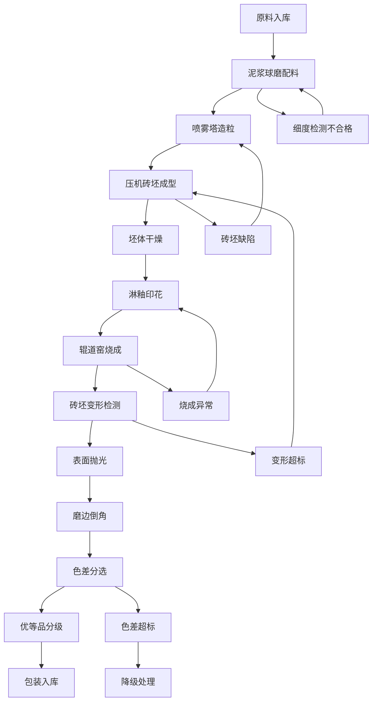

# 陶瓷厂辊道窑瓷砖业务管理后台 PRD

## 1. 产品概述
本系统为陶瓷厂辊道窑瓷砖生产线的全流程管理后台，覆盖从原料到成品的完整生产环节。系统面向陶瓷车间管理人员、工艺工程师和质检人员，提供生产数据监控、工艺参数配置、质量追溯等核心功能，帮助企业实现陶瓷生产过程的数字化、智能化管理。

## 2. 核心功能

### 2.1 用户角色
| 角色 | 注册方式 | 核心权限 |
|------|----------|----------|
| 管理员 | 系统预置 | 全部模块管理、用户权限配置、系统参数设置 |
| 工艺工程师 | 管理员创建 | 工艺参数配置、生产数据分析、报表导出 |
| 车间主管 | 管理员创建 | 生产进度监控、异常处理、班次管理 |
| 质检员 | 管理员创建 | 质量数据录入、检测结果查询、缺陷统计 |

### 2.2 功能模块
1. **数据看板**: 生产概览、关键指标、实时监控、异常告警
2. **原料球磨**: 泥浆球磨配料、原料配比、球磨参数、细度检测
3. **喷雾干燥**: 喷雾塔造粒、粉料水分、造粒效率、塔内温度
4. **压制成型**: 压机砖坯成型、成型压力、砖坯厚度、压制节拍
5. **干燥施釉**: 坯体干燥、淋釉印花、干燥曲线、釉浆参数
6. **辊道窑烧成**: 辊道窑温区、烧成周期控制、窑速调节、气氛控制
7. **抛光磨边**: 表面抛光、磨边倒角、抛光参数、尺寸精度
8. **分级包装**: 砖坯变形检测、色差分选、优等品分级、包装入库

### 2.3 页面详情
| 页面名称 | 模块名称 | 功能描述 |
|----------|----------|----------|
| 数据看板 | 生产概览卡片 | 展示今日产量、合格率、能耗等关键KPI |
| 数据看板 | 实时监控图表 | 各工序实时温度、压力、转速趋势图 |
| 数据看板 | 异常告警列表 | 显示当前生产异常及处理状态 |
| 原料球磨 | 配料管理 | 配方管理、原料配比配置、BOM清单 |
| 原料球磨 | 球磨参数 | 球磨机转速、球石配比、球磨时间、出磨细度 |
| 原料球磨 | 泥浆检测 | 泥浆比重、粘度、含水率、颗粒分布 |
| 喷雾干燥 | 造粒监控 | 喷雾塔进出口温度、压力、进料量 |
| 喷雾干燥 | 粉料质量 | 粉料粒径、水分含量、流动性、松装密度 |
| 压制成型 | 压机管理 | 压机型号、模具规格、生产节拍 |
| 压制成型 | 成型参数 | 压制压力、保压时间、排气次数、砖坯重量 |
| 压制成型 | 砖坯初检 | 厚度偏差、重量偏差、外观缺陷 |
| 干燥施釉 | 干燥曲线 | 干燥窑温区、升温速率、干燥时间 |
| 干燥施釉 | 施釉参数 | 釉浆比重、施釉量、印花图案、釉层厚度 |
| 辊道窑烧成 | 温区控制 | 预热区、烧成区、冷却区各温段温度设定 |
| 辊道窑烧成 | 烧成周期 | 窑速设定、进砖节拍、总烧成时间 |
| 辊道窑烧成 | 气氛控制 | 氧含量、空燃比、窑压调节 |
| 抛光磨边 | 抛光工艺 | 抛光磨头配置、转速、进给量、抛光液 |
| 抛光磨边 | 磨边倒角 | 磨边量、倒角角度、尺寸公差 |
| 分级包装 | 变形检测 | 平整度、直角度、边直度测量数据 |
| 分级包装 | 色差分选 | 色差等级、色号管理、分光测量数据 |
| 分级包装 | 品级判定 | 优等品/一级品/合格品/次品分级规则 |
| 分级包装 | 包装入库 | 包装规格、批次管理、库存更新 |

## 3. 核心流程

## 4. 用户界面设计

### 4.1 设计风格
- **主色调**: 深橙红色 (#C8381F) - 象征窑火与热能，代表陶瓷烧制工艺
- **辅助色**: 暖金色 (#D4A547) - 代表高品质与精致
- **中性色**: 深灰 (#1A1D21)、石板灰 (#374151)、暖白 (#F8F6F3)
- **按钮风格**: 圆角矩形、微阴影、悬停上浮效果
- **字体**: 标题使用 "Noto Serif SC" 衬线体体现工业质感，正文使用 "Noto Sans SC" 保证可读性
- **布局风格**: 左侧导航栏 + 顶部状态栏 + 主内容区卡片式布局
- **图标**: Lucide 图标库线性风格，关键工艺节点使用定制图标

### 4.2 页面设计概述
| 页面名称 | 模块名称 | UI元素 |
|----------|----------|--------|
| 数据看板 | KPI卡片 | 渐变背景、数值动画、趋势箭头、图标徽章 |
| 数据看板 | 实时监控图 | 深色图表区、动态数据流、温区热力色阶 |
| 数据看板 | 告警列表 | 红色闪烁告警、黄色预警、处理进度条 |
| 工艺模块 | 参数表单 | 分组卡片、滑块控件、实时数值显示 |
| 工艺模块 | 数据表格 | 斑马纹、行悬停高亮、批量操作工具栏 |
| 辊道窑烧成 | 温区可视化 | 横向窑炉模拟图、温区色块、温度曲线叠加 |

### 4.3 响应式设计
- Desktop-first，主分辨率 1920×1080 优化
- 次要分辨率适配 1440×900、1600×900
- 侧边栏可折叠，图表自适应容器宽度
- 表格支持横向滚动，移动端采用卡片列表替代

## 5. 数据与报表
- 生产日报/周报/月报自动生成
- 各工序合格率趋势分析
- 能耗与产量对比分析
- 质量缺陷柏拉图统计
- 支持Excel导出和打印
