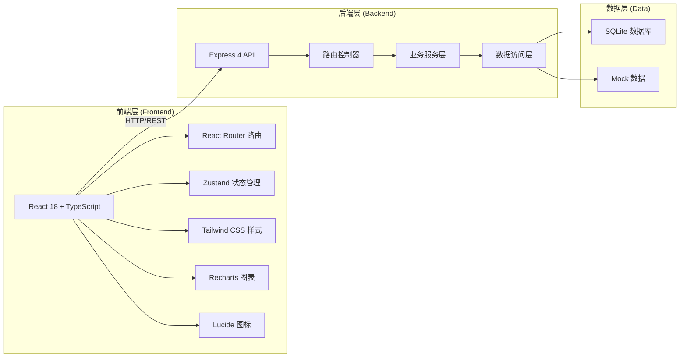
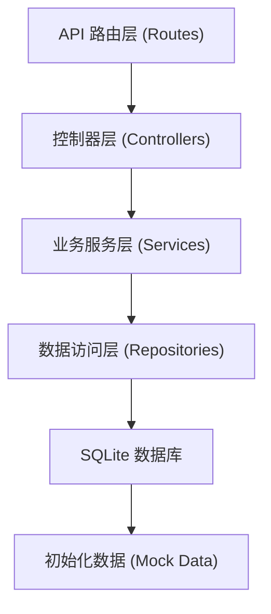
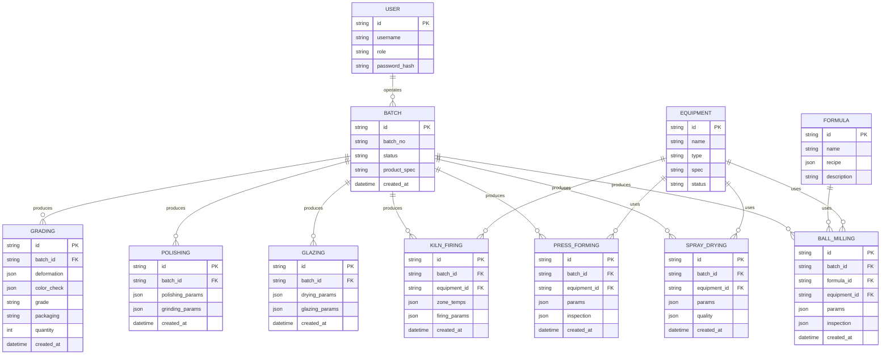

# 陶瓷厂辊道窑瓷砖业务管理后台 技术架构

## 1. 架构设计



## 2. 技术描述
- **前端**: React@18 + TypeScript + Vite + React Router DOM@6 + Zustand@4 + TailwindCSS@3 + Recharts@2 + Lucide React
- **初始化工具**: vite-init (react-express-ts 模板)
- **后端**: Express@4 + TypeScript
- **数据库**: SQLite (better-sqlite3) + Mock 数据
- **样式方案**: TailwindCSS 3 + 自定义工业风主题

## 3. 路由定义
| 路由 | 页面 | 用途 |
|------|------|------|
| /dashboard | Dashboard | 数据看板：生产概览、实时监控、告警 |
| /ball-milling | BallMilling | 原料球磨：配料管理、球磨参数、泥浆检测 |
| /spray-drying | SprayDrying | 喷雾干燥：造粒监控、粉料质量 |
| /press-forming | PressForming | 压制成型：压机管理、成型参数、砖坯初检 |
| /glazing | Glazing | 干燥施釉：干燥曲线、施釉参数 |
| /kiln-firing | KilnFiring | 辊道窑烧成：温区控制、烧成周期、气氛控制 |
| /polishing | Polishing | 抛光磨边：抛光工艺、磨边倒角 |
| /grading-packaging | GradingPackaging | 分级包装：变形检测、色差分选、分级、入库 |
| /login | Login | 用户登录 |

## 4. API 定义

### 4.1 类型定义 (TypeScript)
```typescript
// 生产数据通用
interface ProductionRecord {
  id: string;
  timestamp: string;
  shift: 'day' | 'night';
  operator: string;
  batchNo: string;
}

// 原料球磨
interface BallMillingRecord extends ProductionRecord {
  formulaId: string;
  recipe: { material: string; ratio: number }[];
  ballMillId: string;
  speed: number;
  ballRatio: number;
  duration: number;
  fineness: number;
  slurryDensity: number;
  viscosity: number;
  moisture: number;
}

// 喷雾干燥
interface SprayDryingRecord extends ProductionRecord {
  towerId: string;
  inletTemp: number;
  outletTemp: number;
  pressure: number;
  feedRate: number;
  powderSize: number;
  powderMoisture: number;
  flowability: number;
  bulkDensity: number;
}

// 压制成型
interface PressFormingRecord extends ProductionRecord {
  pressId: string;
  moldSpec: string;
  pressure: number;
  holdingTime: number;
  exhaustCount: number;
  brickWeight: number;
  thickness: number;
  thicknessTolerance: number;
  cycleTime: number;
}

// 干燥施釉
interface GlazingRecord extends ProductionRecord {
  dryerTemp: number[];
  dryingTime: number;
  glazeDensity: number;
  glazeAmount: number;
  patternId: string;
  glazeThickness: number;
}

// 辊道窑烧成
interface KilnFiringRecord extends ProductionRecord {
  kilnId: string;
  zoneTemps: number[];
  zoneCount: number;
  kilnSpeed: number;
  totalFiringTime: number;
  oxygenLevel: number;
  airFuelRatio: number;
  kilnPressure: number;
}

// 抛光磨边
interface PolishingRecord extends ProductionRecord {
  polishingHeadConfig: string;
  polishingSpeed: number;
  feedRate: number;
  polishingFluid: string;
  edgeGrindingAmount: number;
  chamferAngle: number;
  dimensionalTolerance: number;
}

// 分级包装
interface GradingRecord extends ProductionRecord {
  flatness: number;
  squareness: number;
  edgeStraightness: number;
  colorDifference: number;
  colorNo: string;
  grade: 'A' | 'B' | 'C' | 'D';
  packagingSpec: string;
  quantity: number;
}

// KPI 数据
interface DashboardKPI {
  todayOutput: number;
  outputChange: number;
  passRate: number;
  passRateChange: number;
  energyConsumption: number;
  energyChange: number;
  activeAlarms: number;
}

// 告警
interface Alarm {
  id: string;
  level: 'critical' | 'warning' | 'info';
  module: string;
  message: string;
  timestamp: string;
  status: 'pending' | 'processing' | 'resolved';
}
```

### 4.2 API 端点
| 方法 | 路径 | 用途 |
|------|------|------|
| GET | /api/dashboard/kpi | 获取看板KPI数据 |
| GET | /api/dashboard/trend | 获取产量/合格率趋势数据 |
| GET | /api/dashboard/alarms | 获取异常告警列表 |
| GET | /api/ball-milling | 获取球磨记录列表 |
| POST | /api/ball-milling | 新增球磨记录 |
| GET | /api/ball-milling/formulas | 获取配方列表 |
| GET | /api/spray-drying | 获取喷雾干燥记录 |
| POST | /api/spray-drying | 新增喷雾干燥记录 |
| GET | /api/press-forming | 获取压制成型记录 |
| POST | /api/press-forming | 新增压制成型记录 |
| GET | /api/glazing | 获取施釉记录 |
| POST | /api/glazing | 新增施釉记录 |
| GET | /api/kiln-firing | 获取烧成记录 |
| POST | /api/kiln-firing | 新增烧成记录 |
| GET | /api/kiln-firing/realtime | 获取窑炉实时温区数据 |
| GET | /api/polishing | 获取抛光记录 |
| POST | /api/polishing | 新增抛光记录 |
| GET | /api/grading-packaging | 获取分级记录 |
| POST | /api/grading-packaging | 新增分级记录 |
| GET | /api/auth/login | 用户登录 |

## 5. 后端架构



## 6. 数据模型

### 6.1 ER 图


### 6.2 前端目录结构
```
src/
├── components/
│   ├── layout/
│   │   ├── Sidebar.tsx
│   │   ├── Header.tsx
│   │   └── Layout.tsx
│   ├── dashboard/
│   │   ├── KPICard.tsx
│   │   ├── TrendChart.tsx
│   │   └── AlarmList.tsx
│   ├── common/
│   │   ├── DataTable.tsx
│   │   ├── FormCard.tsx
│   │   ├── StatCard.tsx
│   │   └── StatusBadge.tsx
│   └── kiln/
│       ├── KilnVisualizer.tsx
│       └── TempZoneBar.tsx
├── pages/
│   ├── Dashboard.tsx
│   ├── BallMilling.tsx
│   ├── SprayDrying.tsx
│   ├── PressForming.tsx
│   ├── Glazing.tsx
│   ├── KilnFiring.tsx
│   ├── Polishing.tsx
│   ├── GradingPackaging.tsx
│   └── Login.tsx
├── hooks/
│   └── useProductionData.ts
├── store/
│   └── productionStore.ts
├── utils/
│   ├── api.ts
│   ├── format.ts
│   └── mockData.ts
├── types/
│   └── index.ts
├── App.tsx
├── main.tsx
└── index.css
```
